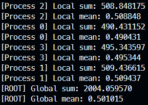
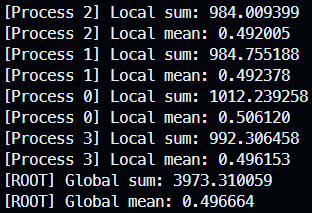

# mpi-mean-calculator

## Descrição

Este projeto implementa um programa de computação paralela usando MPI (Message Passing Interface): calcular a média global de valores gerados localmente em cada processo.

Cada processo gera um vetor local com N valores aleatórios no intervalo [0,1], calcula a soma local e a média local, e então utiliza uma comunicação coletiva (`MPI_Reduce`) para obter a soma global. O processo de rank 0 calcula e exibe a média global.

## Pré-requisitos

MPI instalado (por exemplo OpenMPI). Para isso você pode executar o script `install-mpi.sh` fornecido neste repositório.

```sh
$ chmod +x libs/install-mpi.sh
$ ./libs/install-mpi.sh
```
Verifique a instalação com:

```sh
mpicc --version
```

## Compilação

O projeto já traz um `Makefile`. Você pode compilar a aplicação usando:

```sh
make compile
```

Ou, para executar as etapas padrão (limpar e compilar):

```sh
make
```

O alvo `compile` usa `mpicc` para produzir o binário `main` a partir de `main.c`.

## Execução

Você pode executar o binário gerado diretamente com `mpirun`/`mpiexec` ou usar o alvo `run` do `Makefile`.

Exemplo usando `mpirun`:

```sh
mpirun -np 4 ./main 1000
```

Neste exemplo cada um dos 4 processos gerará 1000 valores aleatórios.

Exemplo usando o `Makefile` (substitua `NP` e `N` conforme necessário):

```sh
make run NP=4 N=1000
```

## Demonstração

Execute o comando abaixo para compilar e rodar o programa com 4 processos, cada um gerando 1000 valores aleatórios:

```sh
make run NP=4 N=1000
```

Saída:



```sh
$ make run NP=4 N=2000
```

Saída:

